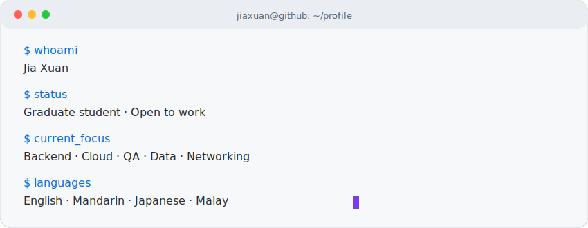

<!--
GitHub Profile README
Username: nasupotato808
-->

<p align="center">
  <picture>
    <source
      media="(prefers-color-scheme: dark)"
      srcset="https://readme-typing-svg.demolab.com?font=Fira+Code&weight=600&size=24&duration=2600&pause=900&color=F5C2E7&center=true&vCenter=true&width=850&height=70&lines=Hi%2C+I%27m+Jia+Xuan;Open+to+work"
    />
    
  </picture>
</p>

<p align="center">
  <!-- <a href="https://your-personal-website.com">
    
  </a> -->
  <a href="https://www.linkedin.com/in/jia-xuan-wong-1a1404262/">
    
  </a>
  <a href="mailto:jxwong119@gmail.com">
    
  </a>
</p>

---

<p align="center">
  <picture>
    <source media="(prefers-color-scheme: dark)" srcset="./assets/terminal-dark.svg" />
    
  </picture>
</p>

---

## 🧰 Tech Stack

<p align="center">
  <picture>
    <source
      media="(prefers-color-scheme: dark)"
      srcset="https://skillicons.dev/icons?i=python,java,ts,js,r,fastapi,nodejs,react,nextjs,firebase,supabase,azure,aws,docker,linux,cloudflare,git,github,mysql,postgres,figma&theme=dark"
    />
    
  </picture>
</p>

| Area | Skills |
|---|---|
| **Languages** | Python, Java, TypeScript, SQL, R |
| **Web & Backend** | FastAPI, REST APIs, Node.js, React, Next.js, Firebase, Supabase |
| **Cloud & DevOps** | Microsoft Azure, AWS Fundamentals, Docker, Linux, Cloudflare Tunnel, Git |
| **Testing & QA** | PyTest, Regression Testing, Exploratory Testing, Test Data Generation, Jira, Azure DevOps |
| **Data & AI** | Pandas, NumPy, API Data Pipelines, LLM Evaluation, Data Visualisation |
| **Networking & Security** | TCP/IP, Subnetting, Routing Fundamentals, Wireshark, Burp Suite |

---

## 🌱 Currently Learning

```txt
> backend        FastAPI · REST APIs · API design
> cloud/devops   Azure · AWS · Docker · Linux
> testing        PyTest · regression testing · test data generation
> data/ai        Pandas · NumPy · LLM evaluation · visualisation
> networking     subnetting · routing · Wireshark
```

---

## 🧑‍💻 Projects

| Project | Focus | Status |
|---|---|---|
| `personal-portfolio` | Portfolio website | Under construction |
| `api-playground` | FastAPI / REST APIs / SQL | Building |
| `cloud-learning-notes` | Azure / AWS / Docker / Linux | In progress |
| `qa-testing-lab` | PyTest / Regression Testing / Test Data | In progress |
| `data-pipeline-lab` | Pandas / NumPy / API Pipelines | Planned |

---

## 📊 GitHub Stats

<table align="center">
  <tr>
    <td align="center" width="50%">
      <picture>
        <source
          media="(prefers-color-scheme: dark)"
          srcset="https://github-readme-stats.vercel.app/api?username=nasupotato808&show_icons=true&theme=tokyonight&hide_border=true&bg_color=0D1117&title_color=F5C2E7&icon_color=F9E2AF&text_color=CDD6F4"
        />
        
      </picture>
    </td>
    <td align="center" width="50%">
      <picture>
        <source
          media="(prefers-color-scheme: dark)"
          srcset="https://github-readme-stats.vercel.app/api/top-langs/?username=nasupotato808&layout=compact&theme=tokyonight&hide_border=true&bg_color=0D1117&title_color=F5C2E7&text_color=CDD6F4&card_width=410"
        />
        
      </picture>
    </td>
  </tr>
</table>

---

<p align="center">
<picture>
  <source media="(prefers-color-scheme: dark)" srcset="https://raw.githubusercontent.com/nasupotato808/nasupotato808/refs/heads/output/github-snake.svg">
  <source media="(prefers-color-scheme: light)" srcset="https://raw.githubusercontent.com/nasupotato808/nasupotato808/refs/heads/output/github-snake.svg">
  
</picture>
</p>

